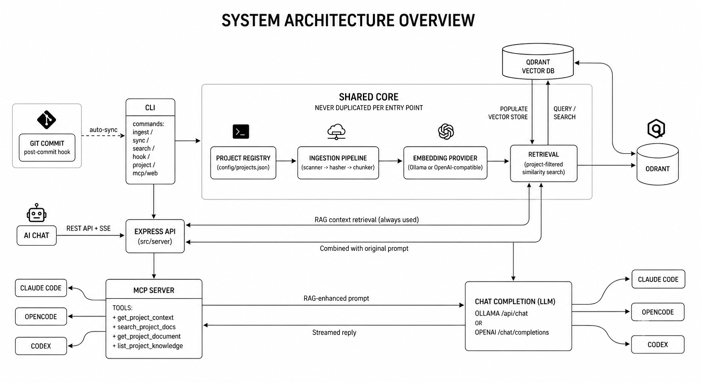
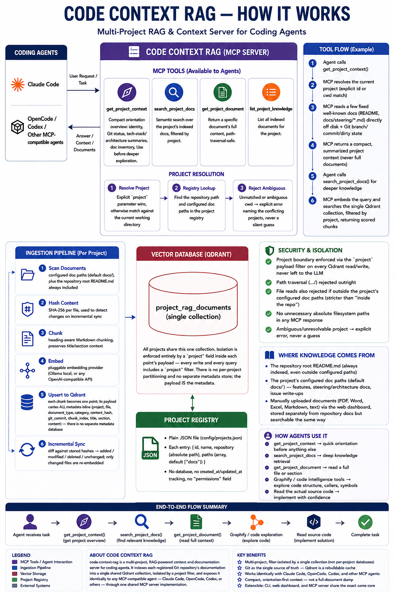
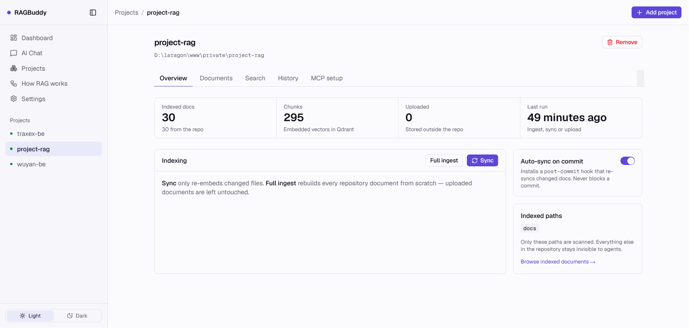
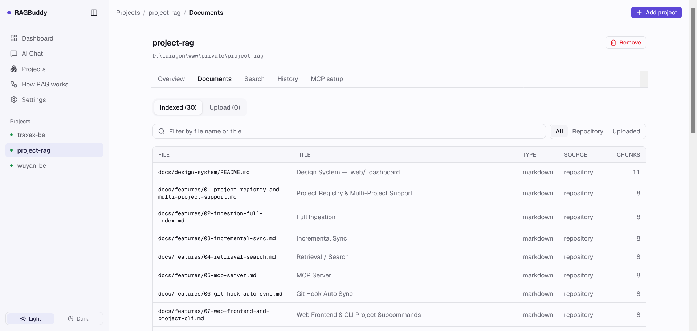
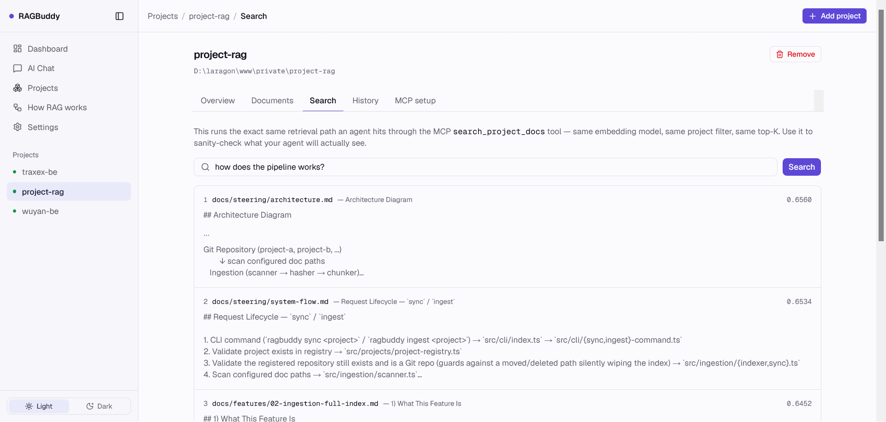
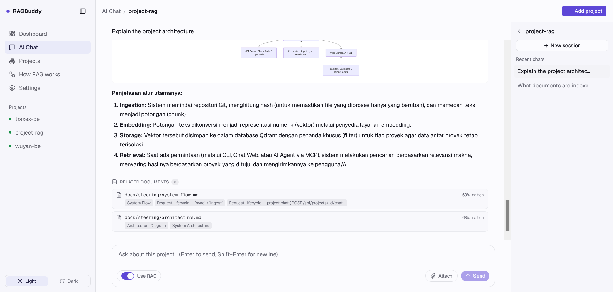
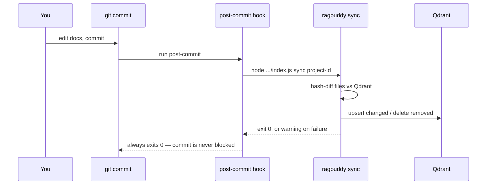

# RAGBuddy

A multi-project RAG (Retrieval-Augmented Generation) service that gives coding agents — **Claude Code**, **OpenCode**, **Codex**, or any other MCP-compatible agent — semantic search over your projects' documentation. Comes with a **CLI**, a **web dashboard**, and an **MCP server**, all sharing the exact same underlying code.

## What it is

**RAGBuddy** indexes the `docs/` folder (configurable) of one or more registered Git repositories into [Qdrant](https://qdrant.tech), a vector database, and exposes that index three ways:

- **CLI** — `ragbuddy ingest/sync/search/hook/project/mcp/web`
- **Web dashboard** — register projects, browse indexed files, upload extra documents, search, chat with a project's indexed docs, run ingest/sync with a live log, review sync history, toggle auto-sync, and copy per-project MCP config, all from a browser
- **MCP server** — a coding agent working in your repo can call `get_project_context` for a quick orientation, then `search_project_docs` to find the architecture doc, feature spec, or issue writeup relevant to what it's doing right now, instead of relying on whatever happened to fit in its context window

## Why it exists

Coding agents work best when they can find the *right* project documentation without a human pasting it in. **RAGBuddy** treats each registered repository's Git history as the single source of truth: the vector index in Qdrant is just a cache. If Qdrant is wiped, `ragbuddy ingest <project>` rebuilds the complete index from the files on disk — nothing is ever stored only in the vector database.

## Architecture



Every project registered with **RAGBuddy** is isolated by a `project` field in Qdrant's payload metadata — a search against one project can never return another project's documents, enforced at the retrieval layer itself, not left to the LLM.

A more detailed visual walkthrough — MCP tools, project resolution, the ingestion pipeline, and how agents are meant to use each tool:



Full details: [`docs/steering/architecture.md`](docs/steering/architecture.md) (layers & components), [`docs/steering/system-flow.md`](docs/steering/system-flow.md) (request lifecycles), [`docs/features/`](docs/features/README.md) (what each feature does, traced to real code).

## Installation

Prerequisites: Node.js 18+ (developed on Node 24), npm, Docker (for Qdrant), and optionally [Ollama](https://ollama.com) if you want local embeddings.

```bash
git clone <this-repository>
cd ragbuddy
npm install
npm run build
cp .env.example .env
```

Edit `.env` to taste (defaults work for a local Ollama + Docker Compose Qdrant setup — see below).

If you want the **web dashboard**, also build the frontend (separate toolchain, own `package.json`):

```bash
cd web
npm install
npm run build
cd ..
```

## Qdrant setup

**RAGBuddy** needs a running Qdrant instance. The included `docker-compose.yml` starts one on `localhost:6333`:

```bash
docker compose up -d
```

**RAGBuddy**'s Node.js process itself runs directly on the host (not containerized) — it needs filesystem access to every registered Git repository, which is simplest to guarantee by not putting it in a container. A future production deployment could containerize it too, by mounting each registered project's directory into the container.

## Embedding configuration

**RAGBuddy** is embedding-provider-agnostic via a small `EmbeddingProvider` interface (`src/embedding/embedding-provider.ts`). Two providers ship today:

**Local (Ollama)** — no data leaves your machine:

```env
EMBEDDING_PROVIDER=ollama
EMBEDDING_BASE_URL=http://localhost:11434
EMBEDDING_MODEL=bge-m3
```

Pull the model first: `ollama pull bge-m3`.

**OpenAI-compatible API** (OpenAI itself, or any self-hosted/proxy service — LiteLLM, vLLM, LM Studio, etc. — that implements a `POST {baseUrl}/embeddings` endpoint matching OpenAI's request/response shape):

```env
EMBEDDING_PROVIDER=openai
EMBEDDING_BASE_URL=https://api.openai.com/v1
EMBEDDING_MODEL=text-embedding-3-small
EMBEDDING_API_KEY=sk-...
```

`EMBEDDING_BASE_URL` works with any such endpoint — omit `EMBEDDING_API_KEY` if it doesn't require one. Not every "OpenAI-compatible" API actually implements `/embeddings` (some chat-completion proxies only implement `/chat/completions`) — verify the endpoint responds to a plain `curl` before wiring it in here.

**RAGBuddy** never assumes you want documentation sent to a cloud provider — Ollama is the default in `.env.example`.

`.env` is loaded automatically (via `dotenv`, resolved against **RAGBuddy**'s own install directory, not whatever directory happens to invoke the CLI — this matters because the git hook below invokes the CLI with its `cwd` set to the *target* repository, not this one).

## Two ways to manage projects: Web or CLI

Both call the exact same underlying registry — pick whichever fits the moment.

### Web dashboard

```bash
npm run web              # or: node dist/cli/index.js web [--port 4300]
```

Open `http://localhost:4300`. The dashboard has a sidebar with these pages:

| Page | What it does |
|------|--------------|
| **Dashboard** | Totals across every project, project cards, and a live feed of recent ingest/sync/upload runs |
| **AI Chat** | Top-level page (`/chat`), not nested under a project. Pick a project first, then chat with its indexed docs — streaming replies, an optional RAG toggle, drag-and-drop file/image attachments, and multiple named sessions kept in the browser |
| **Projects** | Filterable list of every registered repository. `+ Add project` registers a new one — project ID, absolute repo path (**Browse** opens a folder picker over the server's filesystem, so you never have to type or copy-paste it), optional display name, optional comma-separated doc paths (defaults to `docs`) |
| **Project → Overview** | Stats, the ingest/sync console with a live streaming log, the auto-sync toggle, and the indexed paths |
| **Project → Documents** | Browse every indexed file (filter by repository vs uploaded), and **upload your own** PDF / Word / Excel / Markdown / CSV / text documents by drag-and-drop |
| **Project → Search** | The same retrieval path an agent hits over MCP — use it to sanity-check what your agent will actually see |
| **Project → History** | Every ingest, sync and upload for this project, whether it came from the dashboard, the CLI, or a `git commit` |
| **Project → MCP setup** | Copy-pasteable MCP config for Claude Code, OpenCode and Codex, with your machine's real resolved paths already filled in |
| **How RAG works** | Three interactive diagrams — indexing pipeline, retrieval pipeline, auto-sync loop — each step linked to the file that implements it |
| **Settings** | Read-only view of the running configuration (Qdrant, embedding model, resolved paths) |

**Project → Overview** — stats, the ingest/sync console, and the auto-sync toggle:



**Project → Documents** — every indexed file, filterable by repository vs uploaded:



**Project → Search** — the same retrieval path an agent hits over MCP:



Removing a project unregisters it only — it never touches Qdrant vectors or the Git repository itself.

For frontend development with hot reload: `cd web && npm run dev` (proxies `/api` to `localhost:4300`, so `ragbuddy web` must also be running).

### Uploading documents

Some knowledge doesn't belong in the repository — a meeting note, a vendor's API PDF, a spreadsheet of config values, a scratch spec. Drop those on **Project → Documents → Upload**:

- **PDF, Word (.docx), Excel (.xlsx/.xlsm), Markdown, CSV, and plain text** (.txt, .log, .json, .yaml, .rst, .adoc, .tsv) are supported, up to ~20MB per file
- Text is extracted server-side and shaped into Markdown, so a PDF is split by page, a Word file by its own headings, and a spreadsheet by sheet — search results cite `Page 3` or the sheet name rather than just the filename
- Legacy `.doc`/`.xls` and PowerPoint are rejected with a hint (save as `.docx`/`.xlsx`, or export slides to PDF); a scanned PDF with no text layer is rejected with a request to OCR it first
- Files are stored in RAGBuddy's own data directory (`RAGBUDDY_DATA_DIR`, default `./data`) — **nothing is written into your Git repository**
- The original file is kept, not just the extracted text, and they become searchable through the same MCP tools, addressed as `uploads/<filename>`
- A `sync` never reports them as deleted, and a full `ingest` never wipes them — repository documents and uploads are tracked separately in Qdrant
- Re-uploading the same filename replaces it; deleting removes both the file and its vectors

### CLI

```bash
ragbuddy project register <id> <repository> [--name <name>] [--paths <p1,p2>]
ragbuddy project list
ragbuddy project remove <id>
```

`repository` must be an absolute path to a Git repository (a `.git` directory must exist inside it). `paths` defaults to `["docs"]` if omitted. Details: [`docs/features/01-project-registry-and-multi-project-support.md`](docs/features/01-project-registry-and-multi-project-support.md).

(The registry is a plain JSON file at `PROJECT_REGISTRY_PATH`, default `./config/projects.json`, shape shown in `config/projects.example.json` — editing it directly still works too, if you'd rather script it.)

Full details: [`docs/features/07-web-frontend-and-project-cli.md`](docs/features/07-web-frontend-and-project-cli.md) and [`docs/features/08-dashboard-redesign-uploads-and-history.md`](docs/features/08-dashboard-redesign-uploads-and-history.md).

## Chatting with a project

**AI Chat** lives at its own top-level page (`/chat`), not nested under a project's detail tabs — but every chat is still scoped to one project: pick a project first (`/chat`), then ask questions grounded in that project's indexed documents (`/chat/:projectId`).



- Replies stream token-by-token over SSE, with a **Use RAG** toggle controlling whether the last message is routed through retrieval and injected as context
- Keep any number of named sessions per project; nothing is stored on the server — every session lives in the browser's `localStorage`, so it survives reloads
- Attach images and text-like files by picking or dragging them onto the conversation — multiple files at once, mixing images and documents, is fine
- A Stop button aborts a reply mid-stream

Details: [`docs/features/09-project-chat.md`](docs/features/09-project-chat.md).

## Initial ingestion

Full rebuild of a project's index — always safe to re-run, always rebuilds from the files on disk:

```bash
ragbuddy ingest bidubadu
```

(Or click **Ingest** on the project's detail page in the web dashboard — same code path, live-streamed log.)

This scans the project's configured paths, chunks every markdown file (heading-aware, so a chunk keeps its title/section context), embeds every chunk, and replaces the project's entire vector set in Qdrant. Details: [`docs/features/02-ingestion-full-index.md`](docs/features/02-ingestion-full-index.md).

**The repository root's `README.md` is always indexed too**, even for a project registered with `paths: ["docs"]` — it's usually the single most useful thing an agent can read about a project, and it's matched case-insensitively (`Readme.MD`, `README.txt` also work). A README nested in a subdirectory still needs to be inside a configured path.

## Incremental sync

After the first `ingest`, use `sync` day-to-day — it only re-embeds what actually changed, by comparing content hashes already stored in Qdrant against the files on disk:

```bash
ragbuddy sync bidubadu
```

(Or click **Sync** in the web dashboard.)

```
Project: bidubadu

Added:
  docs/features/04-voucher.md

Modified:
  docs/steering/architecture.md

Deleted:
  docs/issue/old-login.md

Skipped:
  docs/README.md

Summary:
  Added: 1
  Modified: 1
  Deleted: 1
  Unchanged: 8
```

Details: [`docs/features/03-incremental-sync.md`](docs/features/03-incremental-sync.md).

## Git hook setup (auto-sync)

Wire `sync` to run automatically after every commit, so the index never drifts from what's actually on disk:

```bash
ragbuddy hook install bidubadu
```

(Or flip the **auto-sync** toggle on the project's detail page in the web dashboard.)

This installs (or safely chains onto an existing) `.git/hooks/post-commit` in the project's repository — it will not disturb an unrelated pre-existing hook (e.g. a linter or another tool's hook already installed there; each tool's block is marker-delimited and only that block is ever touched). **A sync failure never blocks your commit** — if Qdrant or the embedding provider is down, the hook prints a warning and your commit still succeeds:

```
[ragbuddy] Sync started...
[ragbuddy] Warning: RAG sync failed (fetch failed). Git commit remains successful.
```



Remove it with `ragbuddy hook uninstall bidubadu`. Details: [`docs/features/06-git-hook-auto-sync.md`](docs/features/06-git-hook-auto-sync.md).

## MCP setup for Claude Code

> The web dashboard generates all of the snippets below with your machine's real resolved paths already filled in — open any project and go to **MCP setup**. The rest of this section is the same thing, by hand.

Add `ragbuddy` as an MCP server. From your terminal, in any registered project's directory (or anywhere, if you'll pass an explicit project id per call):

```bash
claude mcp add ragbuddy -- node /absolute/path/to/ragbuddy/dist/cli/index.js mcp
```

Or add it directly to your Claude Code MCP config:

```json
{
  "mcpServers": {
    "ragbuddy": {
      "command": "node",
      "args": ["/absolute/path/to/ragbuddy/dist/cli/index.js", "mcp"],
      "env": {
        "QDRANT_URL": "http://localhost:6333",
        "EMBEDDING_PROVIDER": "ollama",
        "EMBEDDING_MODEL": "bge-m3",
        "PROJECT_REGISTRY_PATH": "/absolute/path/to/ragbuddy/config/projects.json"
      }
    }
  }
}
```

Claude Code will then have `get_project_context`, `search_project_docs`, `get_project_document`, and `list_project_knowledge` available. Project resolution is automatic from Claude Code's working directory — pass an explicit `project` argument only if you need to query a different project than the one you're standing in.

## MCP setup for OpenCode

Same server, same four tools — **RAGBuddy** intentionally has one MCP implementation shared by every agent (`init.md` §28), not a separate integration per client. Add it to OpenCode's MCP server configuration the same way, pointing at the same `node .../dist/cli/index.js mcp` command as above:

```json
{
  "$schema": "https://opencode.ai/config.json",
  "mcp": {
    "ragbuddy": {
      "type": "local",
      "command": ["node", "/absolute/path/to/ragbuddy/dist/cli/index.js", "mcp"],
      "enabled": true
    }
  }
}
```

## MCP setup for Codex

Same server again — add it to `~/.codex/config.toml`:

```toml
[mcp_servers.ragbuddy]
command = "node"
args = ["/absolute/path/to/ragbuddy/dist/cli/index.js", "mcp"]
```

No `env` block is needed for any of these three: the server reads `.env` from its own install directory, not from the agent's working directory.

## Teaching your agent to actually use it

The four tools above are visible to your agent automatically once the MCP server connects — no extra config needed for that. But an agent only *reaches* for a tool it happens to think of; it won't necessarily call `get_project_context` before diving into a task just because the tool exists. Add this to the **registered project's** `AGENTS.md` / `CLAUDE.md` so your agent knows when to use each one:

```markdown
## Knowledge Retrieval Strategy (ragbuddy MCP)

Before implementing a non-trivial feature in this project:
  1. Use `get_project_context` first to understand the project (identity, Git status, tech stack/architecture summaries, doc inventory).
  2. Use `search_project_docs` for architecture, business rules, historical issues, conventions, and documented behavior.
  3. Use `get_project_document` to read a full doc found via search when a snippet isn't enough.
  4. Use `list_project_knowledge` to see everything currently indexed when orienting from scratch.
  5. Read the actual source code before making implementation decisions — treat it as the final authority for current behavior.

Don't force `get_project_context` for trivial tasks where it adds no value.
```

## Troubleshooting

- **`[ragbuddy] Error: Project "<id>" is not registered`** — the project id doesn't exist in the registry at `PROJECT_REGISTRY_PATH`. Check via `ragbuddy project list` or the web dashboard.
- **`Repository is not accessible or not a Git repository`** — the registered `repository` path moved, was deleted, or its `.git` folder is missing. `ingest`/`sync` refuse to run rather than silently treating "no files found" as "everything was deleted."
- **`Failed to obtain server version. Unable to check client-server compatibility.`** — Qdrant isn't reachable at `QDRANT_URL`. Check `docker compose ps` / `docker compose up -d`. This warning is otherwise harmless.
- **Embedding request errors (`fetch failed`, `404`, `401`)** — check `EMBEDDING_PROVIDER`/`EMBEDDING_BASE_URL`/`EMBEDDING_MODEL`/`EMBEDDING_API_KEY` and that the provider is actually running, has the model available, and its `/embeddings` endpoint is reachable from this machine (some providers restrict access by IP/network). Test directly with `curl` before assuming it's a **RAGBuddy** bug.
- **`ragbuddy web` seems to exit immediately** — check for a clear `Port <n> is already in use` message; something else (often a previous, un-closed `ragbuddy web`) is already bound to that port. Stop it or pass `--port <other-port>`.
- **A registered project's `paths` isn't `docs`** — `ingest`/`sync`/`get_project_document` all scope correctly to whatever `paths` you registered, not just `docs/`; double-check `config/projects.json` (or the project's detail page) if search results look empty.
- **Auto-sync doesn't seem to run after a commit** — confirm the hook is installed (`hookInstalled: true` on the project's detail page, or `cat .git/hooks/post-commit` in that repo) and that `.env` has real, working values — the hook runs with the *target* repo as its working directory, and both `.env` and the project registry are resolved relative to **RAGBuddy**'s own install directory regardless, so this should work out of the box, but a broken `.env` will fail the same way.
- More: [`docs/steering/setup.md`](docs/steering/setup.md).

## Rebuilding Qdrant from Git

Qdrant is only a cache — the complete index is always reconstructable from the registered Git repositories:

```bash
docker compose down -v   # wipes the qdrant_storage volume
docker compose up -d
ragbuddy ingest <project-id>   # repeat for every registered project
```

## Documentation map

- [`docs/steering/`](docs/steering/README.md) — architecture, tech stack, routing, system flow, API/tool conventions, setup
- [`docs/features/`](docs/features/README.md) — one doc per feature, traced to real files
- [`docs/issue/`](docs/issue/README.md) — bug reports and root cause analysis
- [`docs/design-system/`](docs/design-system/README.md) — tokens, motion and component conventions for the web dashboard
- [`init.md`](init.md) — the original build specification this project was implemented against

## Development

```bash
npm run typecheck   # tsc --noEmit
npm test            # vitest run
npm run build       # compiles src/ to dist/
npm run web         # node dist/cli/index.js web (requires npm run build first)
```

Frontend (`web/`, separate toolchain):

```bash
cd web
npm run dev         # Vite dev server with hot reload, proxies /api to localhost:4300
npm run build       # compiles to web/dist, served by `ragbuddy web`
npx oxlint src      # lint
```

See [`CLAUDE.md`](CLAUDE.md) / [`AGENTS.md`](AGENTS.md) for the coding-agent workflow used to build and extend this project.
