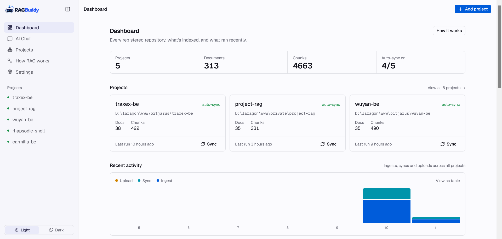
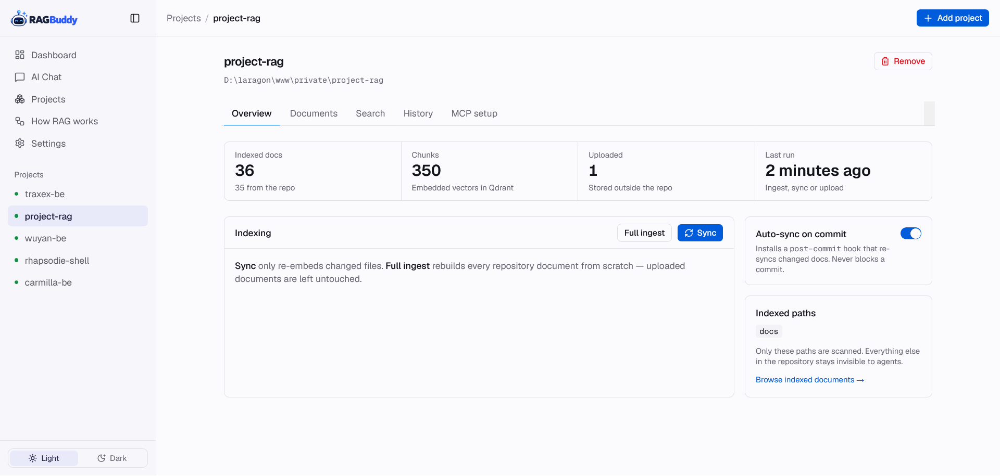
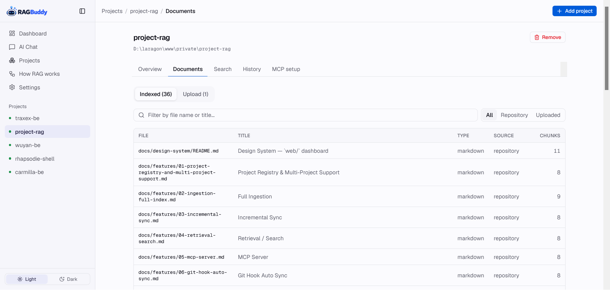
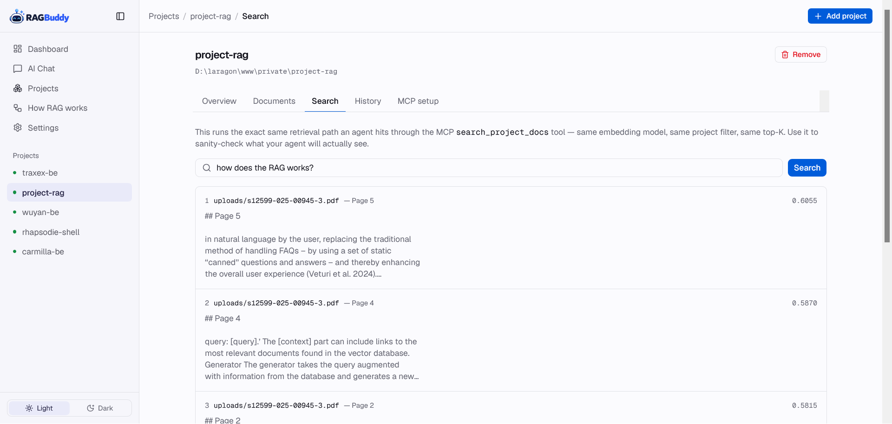
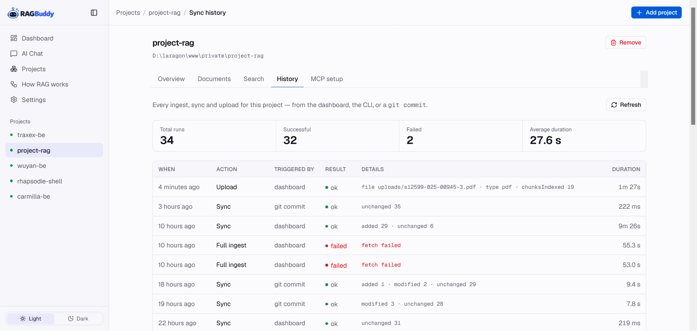
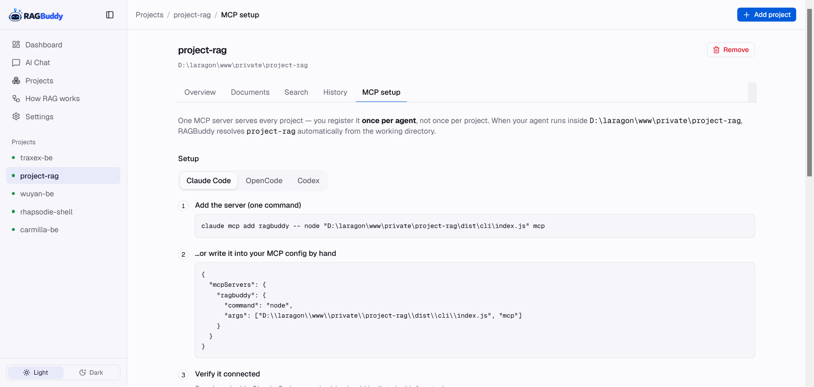
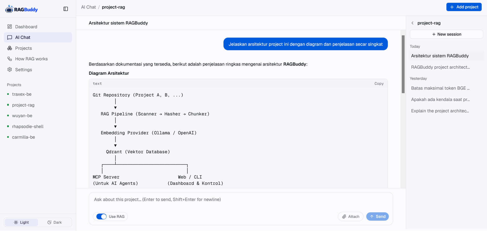
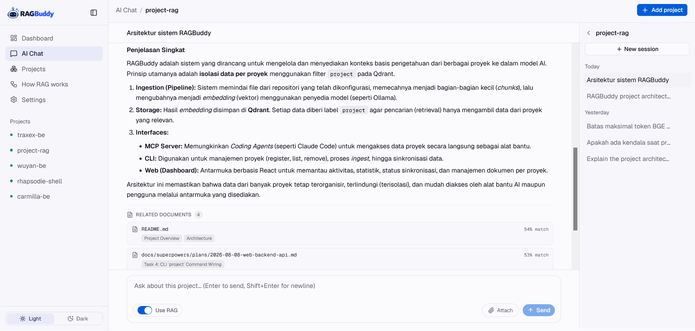

# RAGBuddy


A multi-project RAG (Retrieval-Augmented Generation) platform for **coding agents and developers**. RAGBuddy provides project-aware access to documentation and knowledge through a **web dashboard with AI chat**, **CLI**, and **MCP server** — all powered by the same underlying core.

## What it is

**RAGBuddy** indexes the `docs/` folder (configurable) of one or more registered Git repositories into [Qdrant](https://qdrant.tech), a vector database, and exposes that index three ways:

- **CLI** — `ragbuddy ingest/sync/sync-all/search/ask/hook/project/mcp/web`
- **Web dashboard** — register projects, browse indexed files, upload extra documents, search, chat with a project's indexed docs, run ingest/sync with a live log, review sync history, toggle auto-sync, and copy per-project MCP config, all from a browser
- **MCP server** — a coding agent working in your repo can call `get_project_context` for a quick orientation, then `search_project_docs` to find the architecture doc, feature spec, or issue writeup relevant to what it's doing right now, instead of relying on whatever happened to fit in its context window

## Features

* 🧠 Multi-project RAG with project-isolated retrieval
* 💬 Web AI chat over project knowledge
* 🔌 MCP server for coding agents
* 📚 Repository documentation indexing
* 📎 Upload PDF, Word, Excel, Markdown, CSV, and text documents
* 🔄 Incremental synchronization using content hashes
* 🪝 Git auto-sync on commit, pull, and checkout
* 🗄️ Single Qdrant collection with project-level isolation
* 🧩 Ollama and OpenAI-compatible embedding providers
* 🖥️ Web Dashboard and CLI using the same core implementation

## Architecture


```text
Coding Agents / Web Chat
          │
          ▼
       RAGBuddy
          │
    ┌─────┴─────┐
    │           │
   MCP       Web / CLI
    │           │
    └─────┬─────┘
          ▼
     RAG Pipeline
          │
          ▼
       Qdrant
```

Each project is isolated using a `project` field in the Qdrant payload. Retrieval operations are always filtered by project.

See [`docs/steering/architecture.md`](docs/steering/architecture.md) for the detailed architecture.

## Quick Start

### Requirements

* Node.js 18+
* npm
* Docker
* Qdrant
* Optional: Ollama for local embeddings

### Install

```bash
git clone <this-repository>
cd ragbuddy

npm install
npm run build

cp .env.example .env
```

Start Qdrant:

```bash
docker compose up -d
```

### Configure Embeddings

For local Ollama:

```env
EMBEDDING_PROVIDER=ollama
EMBEDDING_BASE_URL=http://localhost:11434
EMBEDDING_MODEL=bge-m3
```

Then:

```bash
ollama pull bge-m3
```

OpenAI-compatible embedding providers are also supported.

See [`docs/steering/setup.md`](docs/steering/setup.md) for configuration details.

## Register a Project

```bash
ragbuddy project register <id> <repository>
```

Example:

```bash
ragbuddy project register my-project /path/to/my-project
```

Projects can also be managed from the Web Dashboard.

## Index & Sync

Initial indexing:

```bash
ragbuddy ingest <project-id>
```

Incremental synchronization:

```bash
ragbuddy sync <project-id>
```

Install Git auto-sync:

```bash
ragbuddy hook install <project-id>
```

Scheduled re-sync fallback — syncs every registered project, isolating per-project failures; run this periodically from cron/Task Scheduler as a safety net for projects where the git hook was skipped or never installed:

```bash
ragbuddy sync-all
```

RAGBuddy uses the Git repository as the source of truth. Qdrant acts as a rebuildable search index.

## Search & Ask

Query a project's indexed docs directly, without opening the dashboard or a chat session:

```bash
ragbuddy search <project-id> "<query>"
```

Or get a one-shot, RAG-grounded answer straight in the terminal (rewrite → hybrid vector+BM25 search → rerank → one LLM completion, same pipeline the web chat uses):

```bash
ragbuddy ask <project-id> "<query>"
```

```bash
ragbuddy ask my-project "how does auto-sync work?"
```

## Web Dashboard

RAGBuddy includes a web dashboard for managing projects, documents, RAG search, AI chat, ingestion, synchronization, and MCP configuration.

### Dashboard



### Project Overview



### Project Documents



### Project Search



### Sync History



### MCP Setup



### AI Chat




Start the dashboard:

```bash
npm run web
```

Open:

```text
http://localhost:4300
```

For frontend development:

```bash
cd web
npm install
npm run dev
```

## MCP

RAGBuddy exposes project knowledge through MCP.

Available tools:

| Tool                     | Purpose                                       |
| ------------------------ | --------------------------------------------- |
| `get_project_context`    | Get a compact overview of the current project |
| `search_project_docs`    | Semantic search over project knowledge        |
| `get_project_document`   | Read a specific document                      |
| `list_project_knowledge` | List indexed project knowledge                |

Example:

```bash
claude mcp add ragbuddy -- node /absolute/path/to/ragbuddy/dist/cli/index.js mcp
```

The current project can be resolved automatically from the agent's working directory.

See [`docs/steering/mcp.md`](docs/steering/mcp.md) for MCP configuration and usage.

## Teaching your agent to actually use it

The four tools above are visible to your agent automatically once the MCP server connects — no extra config needed for that. But an agent only *reaches* for a tool it happens to think of; it won't necessarily call `get_project_context` before diving into a task just because the tool exists. Add this to the **registered project's** `AGENTS.md` / `CLAUDE.md` so your agent knows when to use each one:

```markdown
## Knowledge Retrieval Strategy (ragbuddy MCP)

Before implementing a non-trivial feature in this project:
  1. Use `get_project_context` first to understand the project (identity, Git status, tech stack/architecture summaries, doc inventory).
  2. Use `search_project_docs` for architecture, business rules, historical issues, conventions, and documented behavior.
  3. Use `get_project_document` to read a full doc found via search when a snippet isn't enough.
  4. Use `list_project_knowledge` to see everything currently indexed when orienting from scratch.
  5. Read the actual source code before making implementation decisions — treat it as the final authority for current behavior.

Don't force `get_project_context` for trivial tasks where it adds no value.
```

## Knowledge Sources

RAGBuddy can index:

```text
Repository
├── README.md
└── configured documentation paths
    ├── features/
    ├── steering/
    ├── issue/
    └── ...
```

Additional documents can be uploaded through the Web Dashboard.

All indexed knowledge is stored in a single Qdrant collection and isolated using the project identifier.

## Documentation

| Documentation                                         | Description                                                       |
| ----------------------------------------------------- | ----------------------------------------------------------------- |
| [`docs/steering/`](docs/steering/README.md)           | Architecture, stack, setup, routing, system flow, and conventions |
| [`docs/features/`](docs/features/README.md)           | Feature documentation                                             |
| [`docs/issue/`](docs/issue/README.md)                 | Issues and root-cause analysis                                    |
| [`docs/design-system/`](docs/design-system/README.md) | Web UI design system                                              |

## Development

```bash
npm run typecheck
npm test
npm run build
npm run web
```

Frontend:

```bash
cd web
npm run dev
npm run build
npx oxlint src
```

See [`CLAUDE.md`](CLAUDE.md) and [`AGENTS.md`](AGENTS.md) for the coding-agent workflow.

## License

See [`LICENSE`](LICENSE).
