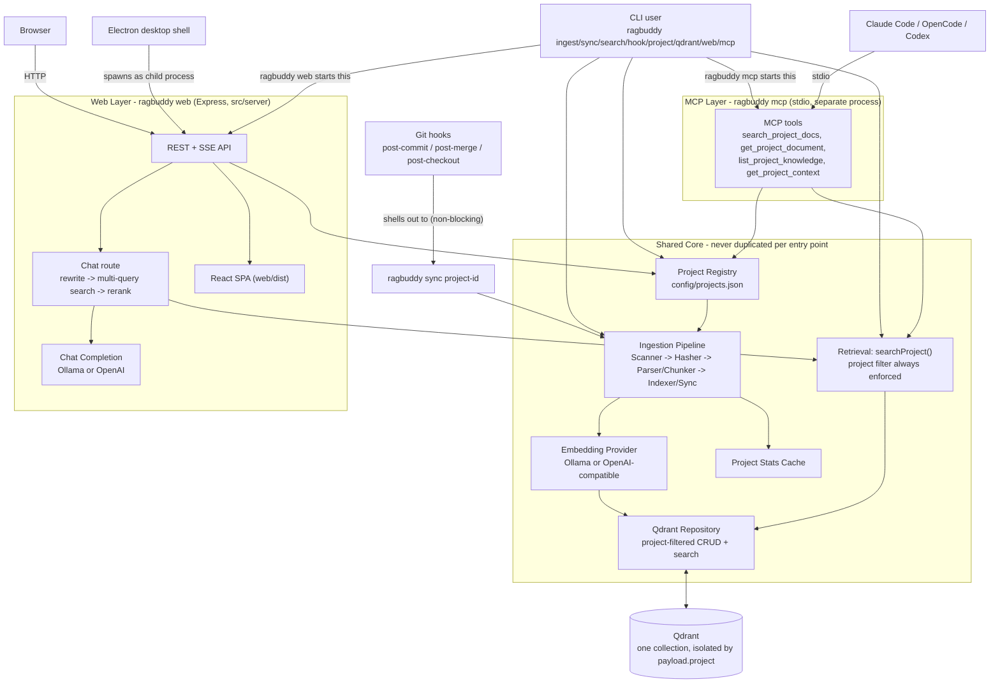
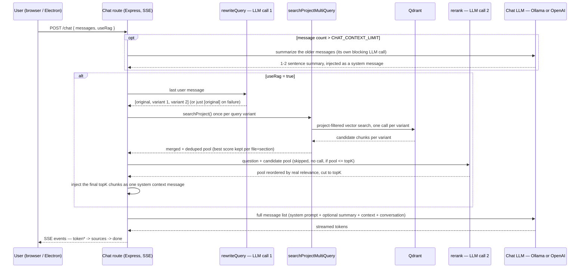
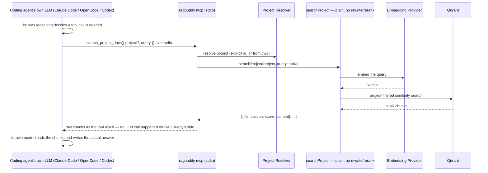

# System Architecture (Corrected)

Redrawn from [`../../images/system-architecture.png`](../../images/system-architecture.png), which has drifted from the real codebase — see "What was wrong" at the bottom for the specific fixes. For the file-by-file breakdown, see [`architecture.md`](./architecture.md).

There are **3 real entry points** into the system, each with its own trigger and its own path through the code:

1. **Git hooks** (auto-sync) — no LLM anywhere in this flow, only embeddings.
2. **AI Chat** (the dashboard's chat page) — RAGBuddy's own server calls a chat LLM directly.
3. **IDE tools** (Claude Code / OpenCode / Codex via MCP) — RAGBuddy never calls a chat LLM here; it only returns chunks, and the *calling agent's own model* (outside RAGBuddy entirely) is what reads them and answers.

That last distinction is the one worth sitting with: "before it reaches the LLM" means something different for each of the two agent-facing entry points, spelled out step-by-step below.

## Component Map (static)

Entry points are **parallel siblings**, not a pipeline — Git hooks, the CLI, the Web server, and the MCP server each call into the Shared Core directly. The old diagram drew `CLI → Express API → MCP Server` as one chain; that doesn't happen anywhere in the code (`docs/steering/architecture.md`'s own dependency direction confirms it).

---

## Flows by Entry Point (dynamic — what happens, in order)

### 1) Git Hook → Auto-Sync

No LLM call of any kind — only the embedding model, which turns text into vectors and never generates a reply.

```mermaid
sequenceDiagram
    participant Dev as Developer
    participant Git as Git (commit / merge / checkout)
    participant Hook as post-* hook script
    participant Sync as ragbuddy sync (CLI)
    participant Scan as Scanner + Hasher
    participant Embed as Embedding Provider
    participant Qdrant as Qdrant
    participant Stats as Project Stats Cache

    Dev->>Git: commit / merge / checkout
    Git->>Hook: fires the installed hook (non-blocking)
    Hook->>Sync: ragbuddy sync project-id (RAGBUDDY_TRIGGER=hook)
    Sync->>Scan: scan configured doc paths, SHA-256 hash each file
    Scan-->>Sync: only changed / added / deleted files
    Sync->>Embed: embed just the changed files' chunks
    Embed-->>Sync: vectors
    Sync->>Qdrant: delete old vectors for changed files, upsert new ones
    Sync->>Stats: refresh cached file/chunk counts
    Sync-->>Hook: exit code (failure only logs a warning, Git operation still succeeds)
```

### 2) AI Chat (dashboard chat page) — steps before the LLM

RAGBuddy's **own server** decides what to send and then calls a chat LLM itself. Two of the steps below are themselves separate, smaller LLM calls (rewrite, rerank) that happen *before* the real answer-generating call — both degrade silently to the plain single-query behavior if they fail, so a flaky rewrite/rerank never blocks the answer.

**Before the answer-generating LLM call, in order:** (1) optional summarize call for old messages, (2) query rewrite call, (3) multi-query Qdrant search, (4) optional rerank call, (5) context assembly — *then* the real chat completion request goes out.

### 3) IDE Tools (Claude Code / OpenCode / Codex via MCP)

RAGBuddy makes **no chat LLM call at all** in this flow. It only returns retrieved chunks; the coding agent's own model (running entirely outside RAGBuddy's process) is what decides to call the tool and what to do with the result.

**Key contrast with AI Chat:** the query never gets rewritten and the results never get reranked here — MCP's `search_project_docs` calls the exact same plain `searchProject()` the CLI's `search` command uses. The rewrite/rerank pipeline is a **chat-route-only** enhancement (see flow 2).

---

## What was wrong in the original diagram

| Original diagram | Reality |
|---|---|
| `CLI → Express API` drawn as a straight pipeline | CLI and the Web server are independent entry points; `ragbuddy web` just *starts* the Express server, nothing routes command traffic through it |
| `Express API → MCP Server` | MCP is a separate stdio process (`ragbuddy mcp`), never nested inside the Web server |
| `MCP Server → Chat Completion (LLM)` | MCP tools never call a chat LLM — they only return retrieved chunks; chat completion belongs solely to the AI Chat route |
| `Chat Completion → Claude Code / OpenCode / Codex` | Those agents connect only to the MCP server over stdio, never to chat completion |
| Two separate Qdrant nodes ("QDRANT VECTOR DB" and "QDRANT") | One Qdrant instance/collection |
| Git hook labeled "post-commit" only | Auto-sync now installs into `post-commit`, `post-merge`, and `post-checkout` |
| No Electron, no React SPA, no credentials store, no rerank/rewrite, no project stats cache | All five exist and are load-bearing parts of the current system |
| No visible distinction between AI Chat's and IDE tools' retrieval | AI Chat rewrites + reranks before answering; MCP/CLI search stays a single plain query — different pipelines entirely |

## Cross-References

- File-by-file breakdown: [architecture.md](./architecture.md)
- Request lifecycles: [system-flow.md](./system-flow.md)
- Chat's retrieval enhancements: [../features/09-project-chat.md](../features/09-project-chat.md)
- MCP tools: [../features/05-mcp-server.md](../features/05-mcp-server.md)
- Electron shell: [../features/11-electron-desktop-app.md](../features/11-electron-desktop-app.md)
- Git hook auto-sync: [../features/06-git-hook-auto-sync.md](../features/06-git-hook-auto-sync.md)
